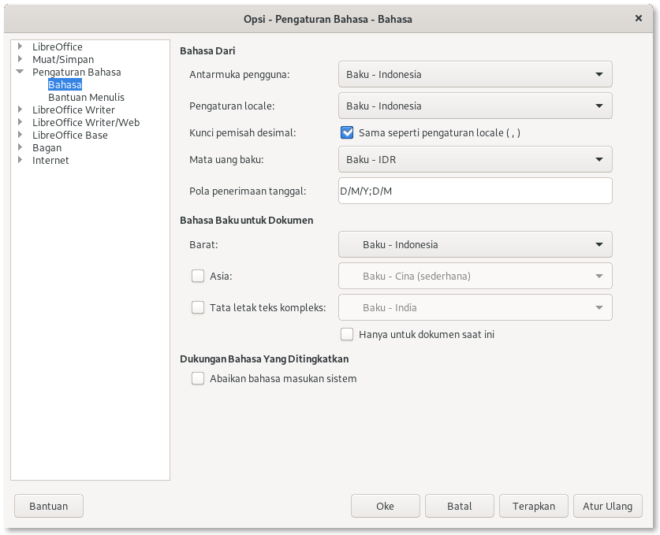
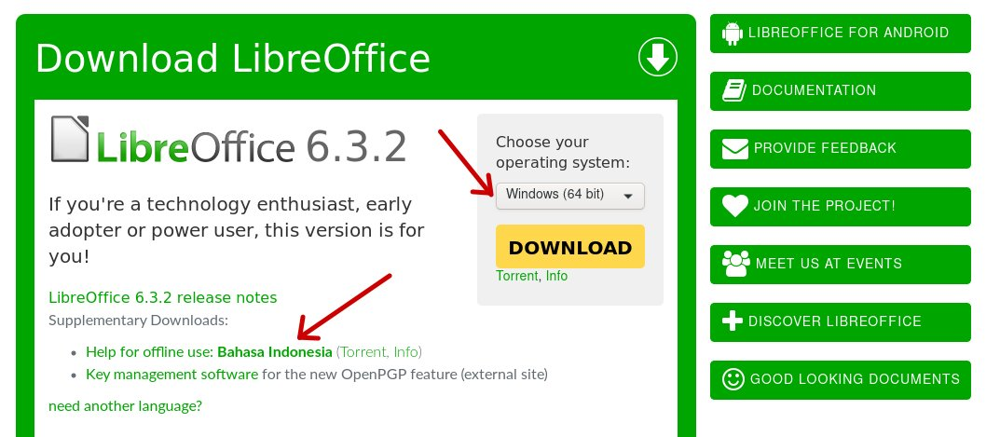
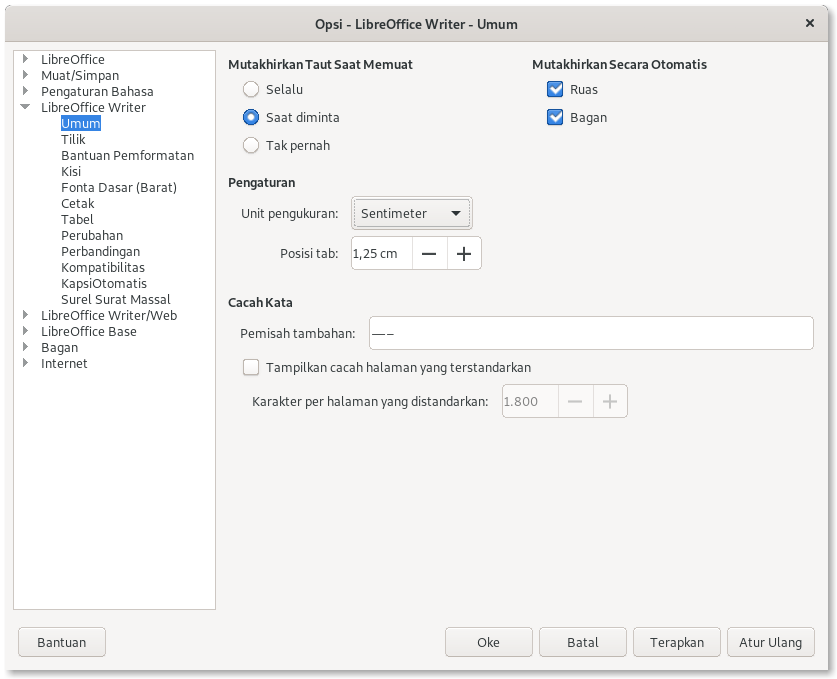
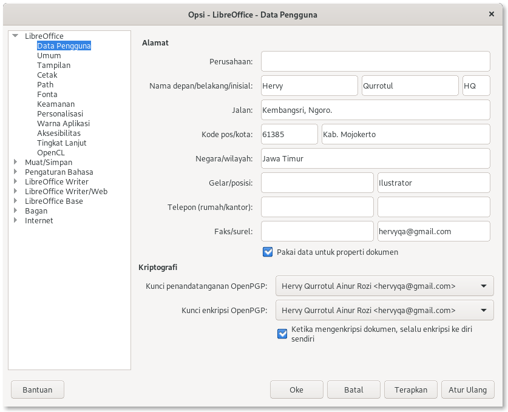
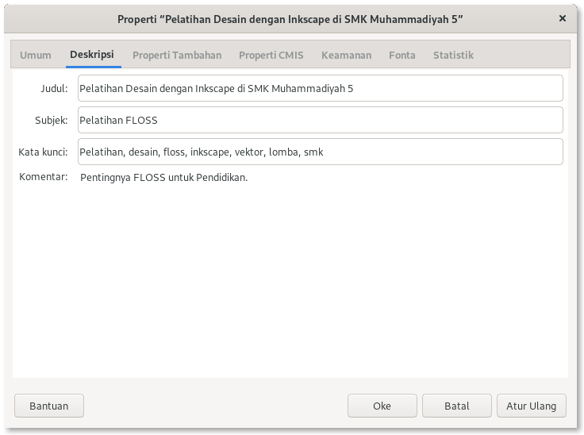
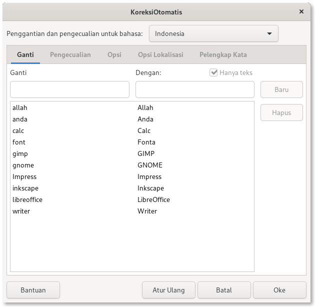
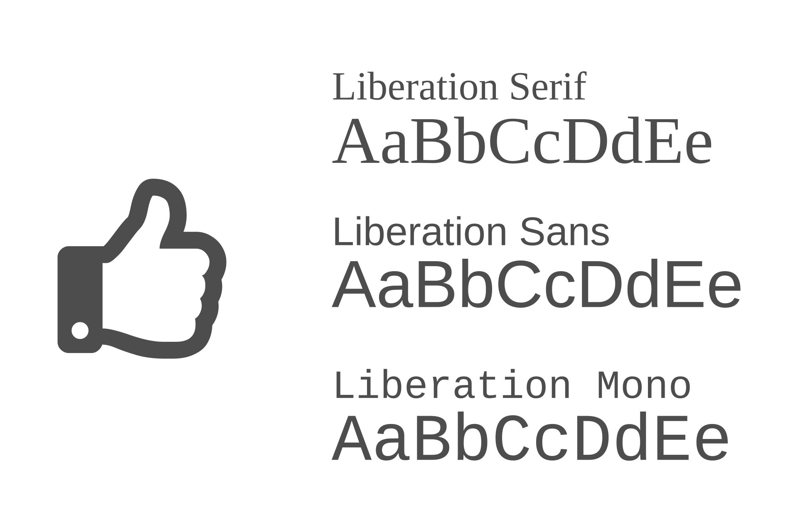
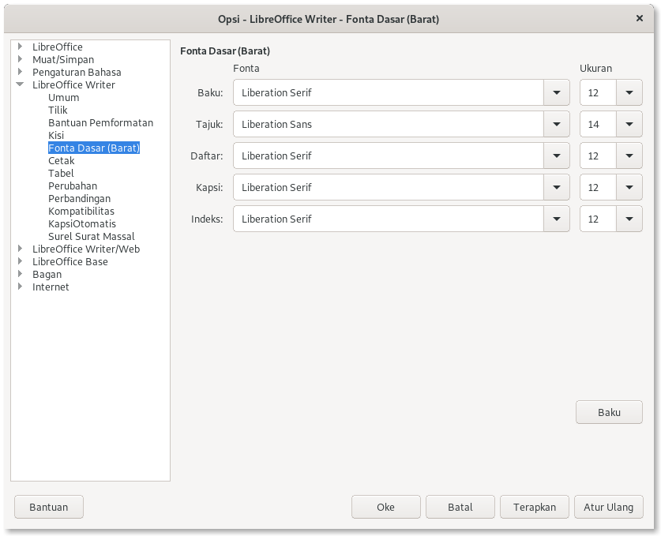

Bismillahirrohmanirrohim.

Pengaturan awal LibreOffice memang perlu dilakukan dulu sebelum memulai membuat dokumen. Pengaturan awal termasuk metadata, fonta, bahasa, format, koreksi otomatis yang kadang dilupakan oleh pengguna LibreOffice awam. Supaya lebih produktif yuk simak tips berikut ini!

***

## Gunakan Bahasa Indonesia sebagai bahasa baku

Harus menggunakan Bahasa Indonesia sebagai bahasa baku di LibreOffice. Mengapa?, sebab fitur Bahasa lokal yang tersedia di LibreOffice merupakan fitur yang bagus untuk orang awam. Bahkan lebih mudah diajarkan untuk anak Sekolah Dasar yang masih baru belajar mengetik. Perlu Anda ketahui ada sekitar tiga ratus lebih kata dan string yang berhasil diterjemahkan oleh Tim Penerjemah LibreOffice Indonesia, sudah sepantasnya untuk menghargai tim penerjemah lokal.

Orang yang sudah terbiasa dengan Bahasa Inggris akan terbiasa juga dengan kata seperti "File, Insert, Paragraph, Style" dan sebagainya. Kemudian ketika diganti dengan Bahasa Indonesia kata tersebut menjadi "Berkas, Sisipkan, Tubuh Teks, Gaya" akan terdengar asing dan aneh. Tetapi itu merupakan masalah adaptasi saja.

Manfaat lain Anda tidak perlu membuat Gaya baru dengan dengan Bahasa Indonesia, sebab Gaya Halaman, Tajuk, Judul, Tubuh teks, dan sebagainya sudah diatur menggunakan Bahasa. Misalnya ketika ingin menambahkan kapsi pada gambar, tabel, diagram tidak perlu lagi menambahkan ruas baru (field), karena sudah ada ruas-ruas dengan Bahasa Indonesia. Hal ini akan membuat mudah dan lebih produktif.

Jadi ketika menggunakan Fitur bahasa lokal akan memudahkan membuat dokumen, asal dokumen tersebut menggunakan Bahasa Indonesia juga. Jika Bahasa Anda masih memakai Bahasa Inggris gantilah dengan cara sebagai berikut:

* Tekan Alt+12 atau pilih menu “Tools” lalu pilih “Option...” .
* Pilih “LibreOffice”.
* Pilih “Language Settings”.
* Pilih “Language”.
* Pada bagian "Language of", di "User Interface" Pilih “Indonesian”.
* Jika selesai pilih “Oke”, Kemudian "Restart Now" untuk membuka ulang LibreOffice.

Jika tidak tampil bahasa Indonesia. Anda harus mengunduh lokal bahasa yang tersedia.

* Pengguna Windows dan Mac silahkan kunjungi [halaman ini](https://www.libreoffice.org/download/).

Sedangkan cara memasang untuk pengguna GNU/Linux, lebih cepat memasang dengan terminal:

* Ubuntu/Debian

`sudo apt install libreoffice-l10n-id`

* Fedora

`sudo dnf install libreoffice-langpack-id`

* openSUSE

`sudo zypper in libreoffice-l10n-id`

* Arch/Manjaro

`sudo pacman -S libreoffice-still-id`

atau `sudo pacman -S libreoffice-fresh-id`

***

## Mengatur Unit Pengukuran

Kedua, biasanya Sistem operasi yang sudah menggunakan format Bahasa Indonesia sebagai format baku secara otomatis LibreOffice mendeteksi unit pengukuran ke sentimeter. Nah, ini manfaat lain mengatur lokal dan memasang Bahasa Indonesia yang secara otomatis mengatur ke sentimeter. Namun, jika format Bahasa Anda masih Bahasa Inggris maka unit yang digunakan adalah inchi, bukan sentimeter. Untuk merubah unit pengaturan tersebut dari inchi ke sentimeter adalah sebagai berikut.

* Tekan Alt+12 atau pilih menu “Perkakas” lalu pilih “Opsi...” .
* Pilih “LibreOffice Writer”.
* Pilih “Umum”.
* Pada Pengaturan, Pilih Unit “Sentimeter”.
* Jika selesai pilih “Oke”.

***

## Mengisi Data Pengguna

Manfaat untuk mengisi formulir Data pengguna yaitu memudahkan pengguna lain untuk mengetahui pemilik berkas tersebut. Data tersebut bermanfaat untuk Metadata berkas dokumen yang Anda buat. Misalnya untuk memudahkan fitur komentar, didalam komentar akan tahu siapa yang penulis komentar (komentar ini berfungsi untuk menambahkan catatan dan perbaikan proposal, makalah, ataupun naskah skripsi). Manfaat lain data pengguna yaitu memaksimalkan metadata berkas. Jika dokumen ODF tersebut diekspor ke PDF, nantinya di metadata PDF akan tertera nama Anda sebagai pemilik dokumen dan piranti lunak apa yang Anda gunakan.

Berikut cara untuk mengisi Data Pengguna LibreOffice:

* Tekan Alt+12 atau pilih menu “Perkakas” lalu pilih “Opsi...”.
* Pilih “LibreOffice”.
* Pilih “Data Pengguna”.
* Pada bagian “Data Pengguna” isilah data pribadi anda.
* Isilah formulir Anda seperti, Nama Perusahaan, Nama Depan/Belakang, Jalan, Kode pos/kota, Negara/Wilayah, Gelar/Posisi, Telepon, Faximili dan Surel. Anda bebas mengisinya.
* Sebagai opsional, jika anda mempunyai kunci kriptografi OpenPGP pilihlah kunci tersebut untuk pendatanganan dan kunci enkripsi. Jika Anda belum membuat kunci OpenPGP buatlah dahulu dengan Piranti Lunak bebas “Seahorse”.
* Jika selesai pilih “Oke”.

***
    
## Mengisi Dokumen Properti

Dokumen Properti penting untuk menampilkan metadata. Mulai dari Deskripsi, Keamanan, Fonta dan lain-lain. Cara untuk mengisi Dokumen properti adalah sebagai berikut:

* Buka Menu “Berkas”.
* Pilih “Properti”.
* Pada Tab “Umum”, Anda bisa memberikan Tanda tangan Digital bila diperlukan
* Pada Tab “Deskripsi”, Anda bisa memasukkan Judul, Subjek, Kata Kunci, Komentar. Deskripsi ini harus diisi untuk keperluan metadata.
* Pada Tab “Keamanan”, di Bagian Opsi berbagi berkas Anda bisa mengceklis “Buka berkas hanya untuk dibaca saja” dan “Rekam Perubahan” Jika diperlukan. Bila ingin lebih privasi gunakan “Proteksi” untuk keamanan dokumen yang lebih kuat. Sekedar pilihan saja.
* Pada Tab “Fonta”, Anda bisa menanamkan fonta pada dokumen dengan menceklis “Tanamkan fonta dalam dokumen”. Sekedar pilihan saja.
* Jika selesai pilih “Oke”.

***

## Koreksi Otomatis

Anda bisa menggunakan fitur Koreksi Otomatis untuk mempercepat Penulisan. Misalnya “libreoffice” diganti dengan “LibreOffice”, “gimp” diganti “GIMP”, dan lain-lain. Adapun cara menggunakan KoreksiOtomatis sebagai berikut.

* Buka menu “Perkakas”.
* Pilih “KoreksiOtomatis”.
* Pilih “Opsi KoreksiOtomatis”.
* Pada tab Ganti, Masukkan kata pada kolom “Ganti” untuk kata awal dan kolom “Dengan” untuk kata pengganti.

## Selalu gunakan Fonta bebas sebagai Baku

Perlu diketahui bahwa LibreOffice sudah mendukung Fonta bebas untuk menggantikan Microsoft Office. Jika Anda pengguna GNU/Linux, Anda tidak perlu memasang fonta Microsoft di Distro GNU/Linux, sebab LibreOffice sendiri sudah menggantikan fonta Microsoft Office sejak LibreOffice itu dibuat.

Fonta Libreoffice yang memiliki kemiripan dengan fonta Microsoft Office sebagai berikut.

* **Liberation Serif** - mirip dengan Times New Roman.
* **Liberation Mono** - mirip dengan Courier New.
* **Liberation Sans** - mirip dengan Arial.

Beberapa fonta ini yang tidak disediakan LibreOffice tetapi ada dikebanyakan repo Distro GNU/Linux.

* **Caladea** - mirip dengan Cambria.
* **Carlito** - mirip dengan Calibri.
* **Cousine** - mirip dengan Courier New.
* **Liberation Sans Narrow (AUR)** - mirip dengan Arial Narrow.

***

## Selalu gunakan ODF

Meskipun Anda bekerja dengan LibreOffice, yakinlah selalu untuk menggunakan Open Document Format (ODF). Gunakan LibreOffice Writer dengan format .odt bukan .doc atau .docx. Ini penting karena berhubungan dengan kompatibilitas dokumen.

Coba bandingkan dengan Format tidak terbuka milik Microsoft, saya ambil contoh .doc dan .docx sebagai piranti lunak pengolah kata-nya. **.doc** untuk Word tahun 97 sampai 2003, sedangkan **.docx** hanya untuk versi Office 2007-2019 untuk saat ini. Sedangkan **.odt** yang sebagai format dokumen teks LibreOffice memiliki kompatibilitas yang kuat, sehingga **.odt** dibuka di LibreOffice versi berapapun tetap tidak berubah pemformatannya. Tidak ada spasi yang rusak, tidak ada paragraf yang kacau. Nah itu hebatnya Libreoffice.

Sekian dari penulis, terima kasih sudah membaca. Semoga bermanfaat.

***
