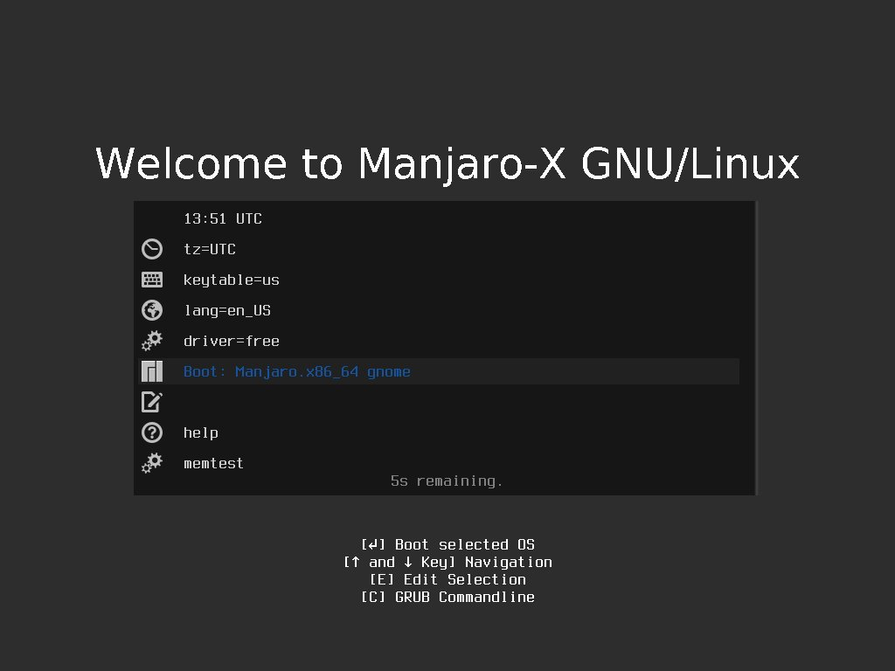
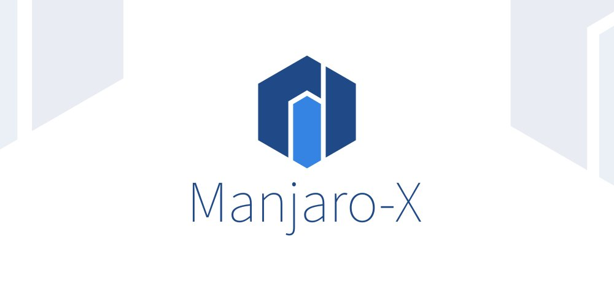

Bismillahirrohmanirrohim.

Manjaro-X dibangun khusus untuk orang awam, pelajar, para pekerja kreatif seperti seniman digital, animator, desainer, penyunting video, dan pengembang aplikasi. Pada kompil 191113 ini, Manjaro-X 18.1.2 lebih pada perbaikan pengaturan baku GNOME, penambahan depedensi dan penampilan pemasang & grub.

***

# Spesifikasi Minimum Manjaro-X

- Bootable DVD atau Flasdisk (ukuran minimal 4 GiB).
- Memiliki 2 GHz processor atau lebih.
- Memiliki RAM minimal 2 GiB (Disarankan 4 GiB).
- Memiliki Penyimpanan data lebih dari 8 GiB.
- Memiliki Resolusi layar minimal 1024 x 768 px (Disarankan 1366 x 768 px)

***

# Unduh Manjaro-X

Manjaro-X hanya tersedia dengan arsitektur x86_x64. Klik [Unduh Manjaro-X](https://osdn.net/projects/manjaro-x/releases/).

***

# Kode Sumber

Kode sumber Manjaro-X ada di repositori Gitlab. Klik [Manjaro-X kode sumber](https://gitlab.com/hervyqa/manjaro-x/).

***

# Perubahan Manjaro-X 18.1.2-191113

## Tema grub minimalis

Tampilan Manjaro-X lebih sederhana dengan tampilan abu-abu khas Adwaita-dark di mode live.

***

## Tampilan Slide Calamares

Berikut tampilan calamares yang baru untuk Manjaro-X. Menggunakan palette Adwaita-dark sebagai warna dominannya.


  
  



  
  
  



  
  
  

***

## Depedensi Gnome-builder

Beberapa depedensi gnome-builder ditambahkan seperti:

- gnome-code-assistance
- rustup
- eslint

Pengaturan Eslint dan Pylint secara baku aktif.
Pengaturan gsetting untuk `darkmode` dan `lightmode` berlaku juga untuk scheme gnome-builder.


  
  


***

## Tampilan inkscape lebih sederhana

Pengaturan inkscape lebih sederhana dan menggunakan palette tango secara baku.




  
  


## Logo baru Manjaro-X

Manjaro-X merupakan distro yang berbeda, sebab Manjaro-X ketika dipasang akan kembali dengan branding Manjaro. Jadi branding Manjaro-X hanya berlaku untuk mode live saja.

Logo baru Manjaro-X dominan warna biru GNOME. Warna biru tua berasal dari warna Tango (warna skema terminal GNOME) dan warna biru muda berasal dari palette biru GNOME. 

Logo Hexagonal artinya memiliki sistem yang solid dan elegan. Dan inisial yang membentuk huruf M terbentuk dari kata Manjaro.

## Gabung dan berlangganan

telegram: https://t.me/manjaro_x

***

