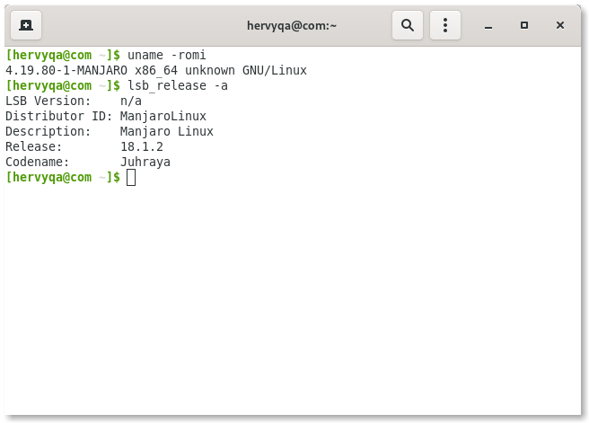
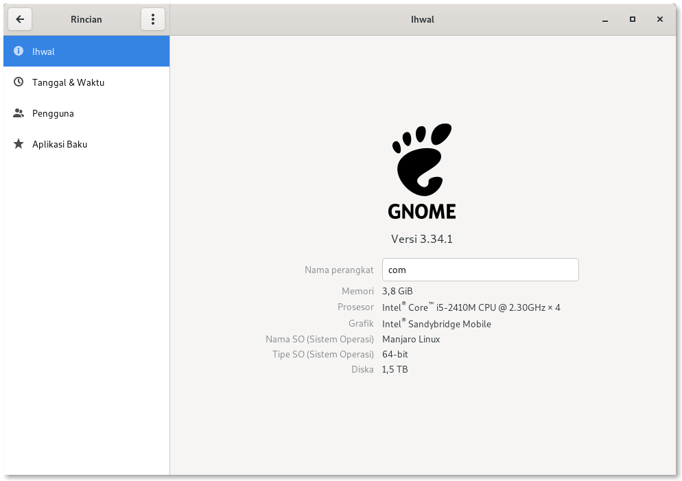

Bismillahirrohmanirrohim.

Manjaro-X 18.1.2 dirilis dalam jangka waktu yang lumayan dekat. Setelah beberapa hari menunggu rilis Manjaro 18.1.2 akhirnya Manjaro-X ikut merilis versi barunya. Manjaro-X dibangun khusus untuk orang awam, pelajar, para pekerja kreatif seperti seniman digital, animator, desainer, penyunting video, dan pengembang aplikasi.

***

# Spesifikasi Minimum Manjaro-X

- Bootable DVD atau Flasdisk (ukuran minimal 4 GiB).
- Memiliki 2 GHz processor atau lebih.
- Memiliki RAM minimal 2 GiB (Disarankan 4 GiB).
- Memiliki Penyimpanan data lebih dari 8 GiB.
- Memiliki Resolusi layar minimal 1024 x 768 px (Disarankan 1366 x 768 px)

***
# Unduh Manjaro-X

Manjaro-X hanya tersedia dengan arsitektur x86_x64. Klik [Unduh Manjaro-X](https://osdn.net/projects/manjaro-x/releases/).

***

# Kode Sumber

Kode sumber Manjaro-X ada di repositori Gitlab. Klik [Manjaro-X kode sumber](https://gitlab.com/hervyqa/manjaro-x/).

***

# Perubahan Manjaro-X 18.1.2

## Menggunakan Kernel LTS

Manjaro-X mulai versi 18.1.2 akan tetap menggunakan kernel LTS. Pada rilis versi ini menggunakan kernel linux 4.19.80-1. Dikatakan LTS karena Manjaro-X menggunakan `linux-lts` didalam depedensinya, tak hanya itu dukungan LTS `linux-lts-broadcom-wl` untuk kartu wifi broadcom, dan `linux-lts-headers` untuk dukungan modul Headers.

Manjaro-X juga lebih stabil karena masih mendukung perangkat lama, ada dukungan modul untuk catalist dan nvidia. Pada versi 18 ini Manjaro-X menghapus `manjaro-settings-manager` sebab GNU/Linux ini dibuat untuk orang awam sehingga tidak perlu memperdulikan kernel linux yang terbarukan, jika ada kernel linux LTS baru maka secara otomatis sistem akan memperbarui kernel.

> Lupakan kernel dan tetaplah produktif.
> __- tim X__

***

## GIMP Paint Studio

**GIMP (GNU Image Manipulation Program)** menggunakan versi 2.10 berevolusi menjadi **GIMP Paint Studio** yang mengambil depedensi dari **AUR (Arch User Repository)**. Tampilan Layout yang baru dan menggunakan icon legacy agar cocok dengan `lightmode` ataupun `darkmode`.

Alasan memasukkan **GIMP Paint Studio** adalah selain digunakan untuk memanipulasi gambar, **GIMP Paint Studio** mampu menggantikan digital painting di lingkungan destop GNOME sebab basisnya adalah GTK. Ada pula aplikasi menggambar digital Krita, tetapi krita berasal dari KDE.



***

## Dukungan Pencetak EPSON 

Manjaro-X terdapat dukungan pencetak **EPSON** yang terdiri dari 669 jenis printer. Dukungan Pencetak ini diambil dari paket AUR `epson-inkjet-printer-escpr` dan `epson-inkjet-printer-escpr2`.
[lihat daftar pencetak](https://gitlab.com/hervyqa/manjaro-x/raw/master/manjaro-x-epson-list.txt)

***

## GNOME Aplikasi

Manjaro-X Menggunakan GNOME 3.34.1. Aplikasi GNOME yang dimasukkan antara lain:

Rilis baru:

* **GNOME Podcast**: Aplikasi bebas Podcast dari GNOME.
* **Drawing**: Alternatif alat gambar ringan selain GIMP.
* **GNOME Latex**: Menulis dokumen dengan Latex.

Aplikasi GNOME Sebelumnya :

* **Boxes**: Mesin Virtualisasi dan jarak jauh yang sederhana.
* **Brasero**: Pembakar CD/DVD.
* **Builder**: IDE dan Pengembang Aplikasi GTK.
* **Cheese**: Kamera WebCam.
* **Disk**: Utilitas manajemen partisi.
* **Deja Dup**: Pencadangan dan Menjaga data-data penting.
* **Glade**: Perancang Desain UI/UX bagi Aplikasi GTK.
* **Epiphany**: Penjelajah Web.
* **Empathy**: Layanan Obrolan.
* **Evolution**: Pengolah Surat Elektronik.
* **FeedReader**: RSS Klien.
* **Fragment**: Klien BitTorrent.
* **gThumb**: Penampil Gambar.
* **Multiwriter**: Penulis berkas ISO ke beberapa perangkat sekaligus.
* **Notes**: Penulis catatan sederhana.
* **Peek**: Perekam GIF.
* **Polari**: Klien Internet Relay Chat (IRC).
* **Rhythmbox**: Pemutar musik.
* **Todo**: Manajer tugas.
* **Totem**: Pemutar Video.

## Aplikasi yang membuat Anda lebih Produktif selain dari GNOME

Rilis Baru:

* **Gimp Paint Studio**: Kumpulan brush dan preset untuk menggambar digital dengan GIMP.
* **Gnac**: Perubah Format Audio (Audio Konverter).
* **Gigle**: GUI untuk Git.
* **Handbrake**: Perubah encoding Audio dan Video.
* **Klavaro**: Aplikasi pendidikan, belajar mengetik untuk awam.

Aplikasi produktif lain:

* **Blender**: Pengolah Animasi dan Penyunting Video.
* **Gimp**: Pengolah Bitmap.
* **Inkscape**: Pengolah Vektor.
* **LibreOffice**: Alat Perkantoran. Libreoffice Impress, Writer, Calc, Draw, & Base. (Didukung dengan Bahasa Indonesia)
* **Telegram**: Perpesanan Modern.

Pengaturan lanjutan:

* **Penyunting Dconf**: Penyunting basis data dconf.
* **Tweak-tool**: Pengaturan lanjutan.
 
Perkakas CLI :

* **Tor**: Jalur jaringan TOR.
* **Hugo**: Generator web statis.
* **Youtube-dl**: Pengunduh Video.

## Cuplikan Menu


  
  



  
  


## Daftar Apikasi yang dihapus dari Manjaro-X

* **Steam**: Permainan dari Valve. (Bukan distro fokus Gaming)
* **TimeShift**: Pencadangan Data. (Sudah tergantikan dengan Deja Dup)
* **Uget**: Pengunduh banyak berkas. (Sulit integrasi dengan Epiphany)

Jika ada saran dan kritikan silahkan komentar dibawah ini. Sekian, semoga bermanfaat.
***
